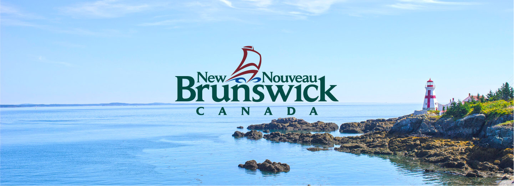

# Projeto Airbnb New Brunswick
   

  

# Analise dos Dados do Airbnb de New Brunswick, Canadá

O Airbnb já é considerado como sendo a maior empresa hoteleira da atualidade. Ah, o detalhe é que ele não possui nenhum hotel!
A Startup fundada 10 anos atrás, conta com mais de 4 milhões de anfitriões, que já receberam mais de 1 bilhão de hóspedes em quase todos os países, desafiando as redes hoteleiras tradicionais.
Uma das iniciativas do Airbnb é disponibilizar dados do site, para algumas das principais cidades do mundo. Por meio do portal Inside Airbnb, é possível baixar uma grande quantidade de dados para desenvolver projetos e soluções de Data Science.

New Brunswick é uma região do leste do Canadá, tendo sua capital como Fredericton. Além de ser circundada pelo Atlântico, a província possui vários rios, florestas de pinheiros, montanhas e a famosa baía de Fundy, que é conhecida por suas marés extremas e pela presença frequente de baleias, o que pode ser uma ótima pedida para os aventureiros que desejam ver o animal de perto em seu habitat natural.
A maior cidade é Moncton, porém, o território possui cerca de 70 mil quilômetros quadrados. Destes, 80% é composto de florestas e somente 20% é habitado ou destinado à agricultura. Uma curiosidade é que New Brunswick é a única província oficialmente bilíngue do país, com um percentual muito grande se sua população que fala inglês e francês.

# Dataset
O conjunto de dados pode ser facilmente encontrado aqui: http://insideairbnb.com/get-the-data/

# Bibliotecas necessárias

* Pandas
* Matplotlib
* Seaborn 
* folium 
Você também precisará de um software que possa executar um notebook python .ipynb

# Metodologia

* Quantos atributos (variáveis) e quantas entradas o nosso conjunto de dados possui? Quais os tipos das variáveis?
* Qual a porcentagem de valores ausentes no dataset?
* Qual o tipo de distribuição das variáveis?
* Qual a média dos preços de aluguel?
* Qual a correlação existente entre as variáveis
* Qual o tipo de imóvel mais alugado no Airbnb?
* Qual a localidade mais cara do dataset?
* Qual é a média do mínimo de noites para aluguel ?

# Resultados
Neste notebook, foi feita uma análise superficial dos dados do airbnb da região de New Brunswick, Canada, tendo o banco de dados sido obtido do Airbnb no mês de novembro de 2022. Para aprimorar a análise, alguns outliers identificados por meio da visualização de histogramas de dados foram eliminados. Finalmente, deve-se notar que esta análise, assim como o conjunto de dados utilizado, é uma versão resumida, com um número limitado de atributos. A falta de uma base de dados grande em alguma regiões dificultar e/ou pode distorcer algumas conclusões.

Análise do dataset:
* linha: 3232
* colunas: 18

Remoção de outliers:
* preço
* noites minimas

Preço médio da hospedagem:
Valor Médio = 157.72$
O tipo de imóvel mais alugado no Airbnb, depois de remover os outliers: Quantidade:

* Entire home/apt: 2544
* Private room: 651
* Hotel room: 4
Shared room: 2

porcentagem:
* Whole houses/apartments: 79.48%.
* Private rooms: 20.34%.
* Shared rooms: 0.12%.
* Hotel rooms: 0.06%.

De acordo com a analise, a vizinhaça mais com a hospedagem mais cara em New Brunswick após remover os outliers são:

neighbourhood
* Saint-Andre: 400.00
* Dufferin: 305.40
* North Lake: 281.29
* Kars: 256.67
* Hardwicke: 234.89
* Musquash: 233.33
* Saint David: 228.14
* Weldford: 226.58
* Campobello: 225.56
* West Isles: 224.22
A média do mínimo de noites para aluguel são: 2,5 dias.
